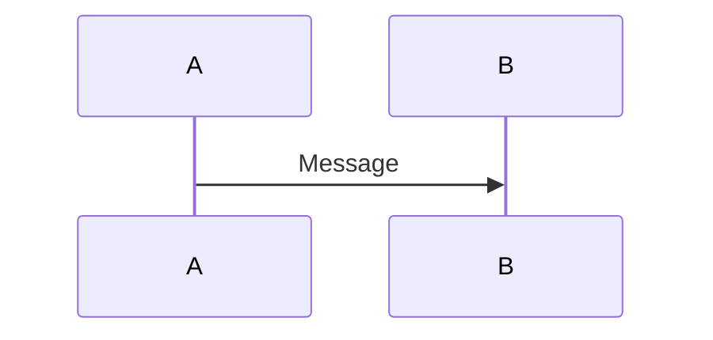
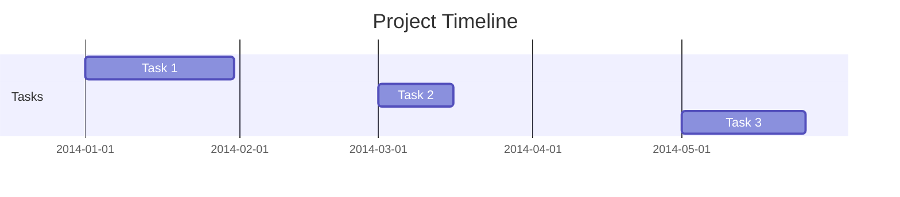
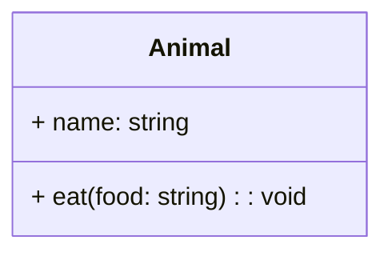
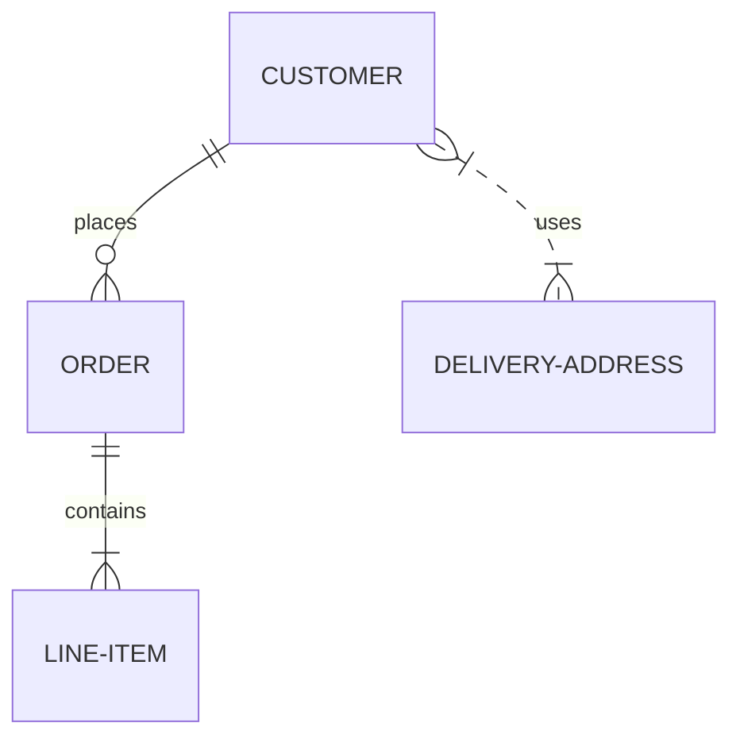
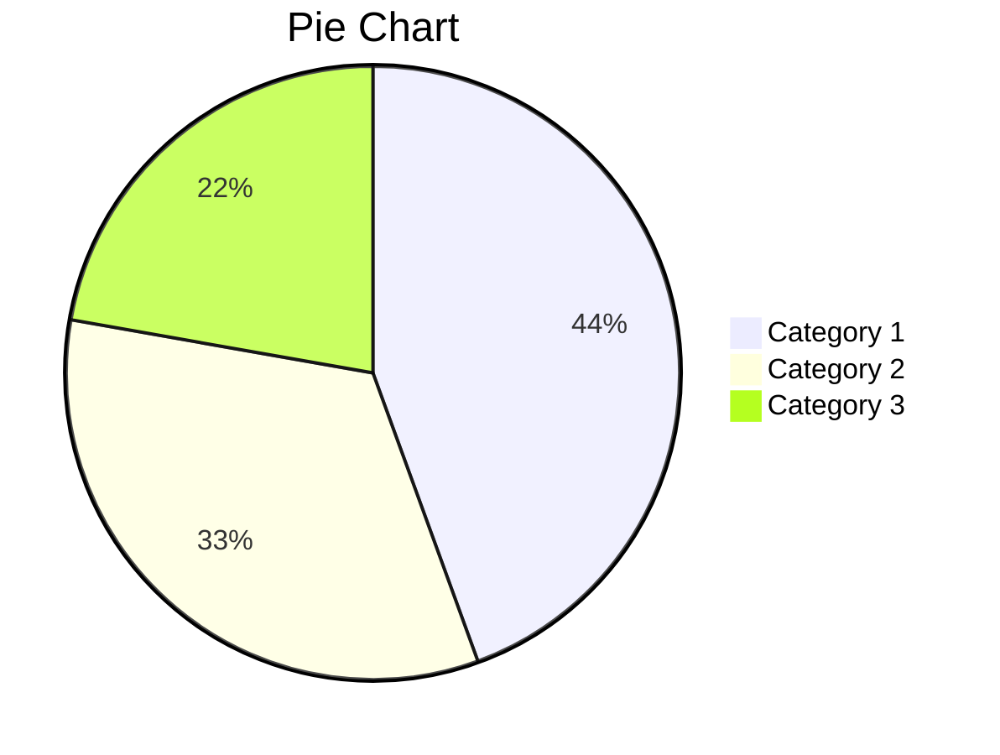

# Flowcharts


# Sequence Diagrams




# Gantt Chart



# Class Diagram



# State Diagram

```mermaid

stateDiagram
    [*] --> State1
    State1 --> [*]
    State1 : this is a string
    State1 : this is another string
    State1 -> State2
    State2 --> [*]
```

# Entity Relationship Diagram



# Pie Chart



# Bar Chart

```mermaid

bar
    title Bar Chart
    x-axis Label: Value
    "Category 1": 40
    "Category 2": 30
    "Category 3": 20
```

# Line Chart

```mermaid

line
    title Line Chart
    x-axis Label: Value
    y-axis Label: Value
    "Series 1":
        - x: 1, y: 10
        - x: 2, y: 20
        - x: 3, y: 15
    "Series 2":
        - x: 1, y: 15
        - x: 2, y: 10
        - x: 3, y: 25
```

# Swimlane Diagram

```mermaid

swimlaneDiagram
    lane Customer
        Customer->>Order: Submit Order
    lane Order
        Order->>Warehouse: Process Order
    lane Warehouse
        Warehouse-->>Customer: Ship Order
```
